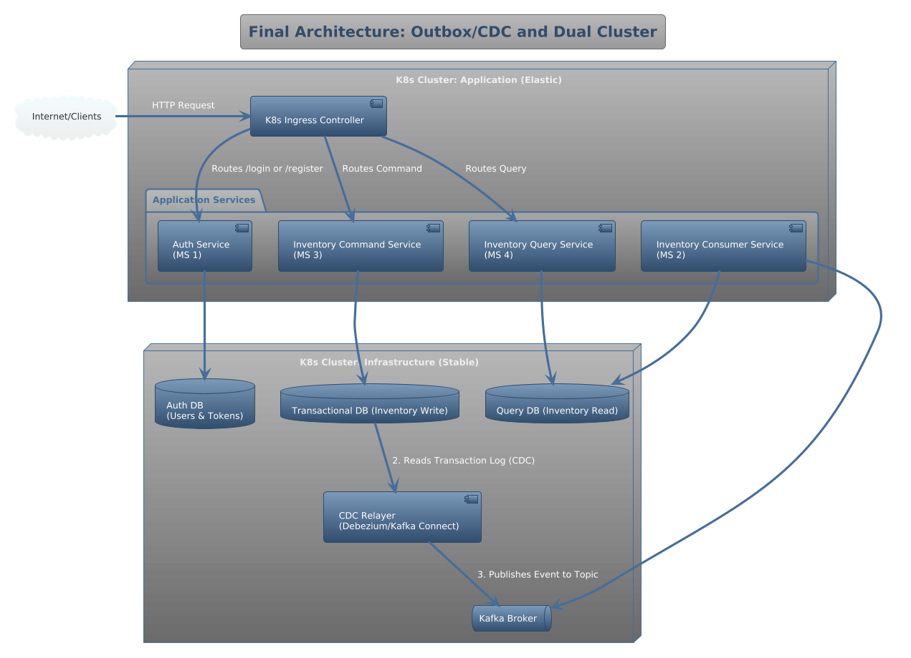
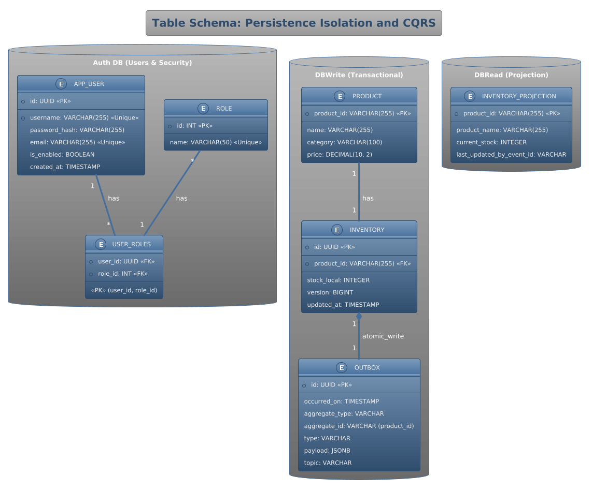

# Technical Backend Simulation - Supermarket Microservices Architecture

## 1. Architecture: CQRS, EDA (Kafka), Outbox/CDC, and K8s

This project simulates the implementation of a robust and scalable microservices architecture, leveraging the following advanced patterns and technologies:

- **CQRS (Command Query Responsibility Segregation):** Separation of Write (Command) and Read (Query) responsibilities into dedicated services.
- **EDA (Event-Driven Architecture):** Asynchronous communication via the Apache Kafka event broker.
- **Outbox Pattern + CDC (Debezium):** Guaranteeing atomicity between the transactional DB write and event publishing.
- **Containerization:** Using Docker and Docker Compose for local deployment, simulating a real Kubernetes environment.
- **Isolation:** Segregation of persistence layers (Inventory Write DB, Read DB, and dedicated Auth DB).

---



---

## 2. Data models

The system uses three separate databases to ensure strict isolation and adherence to the CQRS pattern.

### 1. Auth DB (Users & Security)
Used by the **Auth Service** (MS 1). It manages user identities and roles.
*   **USERS**: Stores user credentials (hashed passwords) and profile information.
*   **ROLES**: Defines available roles (USER, ADMIN).
*   **USERS_ROLES**: Many-to-Many relationship between users and roles.

### 2. Transactional DB (DBWrite)
Used by the **Inventory Command Service** (MS 3). It handles all write operations and domain logic.
*   **PRODUCTS**: Stores product catalog information (source of truth for products).
*   **INVENTORY**: Manages local stock levels. Modifications here are transactional.
*   **OUTBOX**: Implements the *Transactional Outbox Pattern*. Events are written here in the same transaction as inventory changes to ensure eventual consistency without distributed transactions (2PC). Debezium reads this table to push events to Kafka.

### 3. Query DB (DBRead)
Used by the **Inventory Query Service** (MS 4) and updated by the **Inventory Consumer Service** (MS 2).
*   **INVENTORY_PROJECTION**: A read-optimized view of the inventory. It is updated asynchronously via Kafka events.
---



---

## 3. Repository Decision: Monorepo vs. Polyrepo

### Architectural Justification

In a real production environment, the preferred repository model is **Polyrepo (Multiple Repositories)**. This model ensures the complete **autonomy** of each microservice, allowing for:

1.  **Independent CI/CD:** Each service can have its own isolated deployment pipeline.
2.  **Decoupling:** Teams can work on their service without creating unnecessary coupling in the Git history.
3.  **Scalability:** Git performance remains optimal as the number of services grows.

### Decision for the Simulation

To simplify the setup, compilation, and presentation of this technical exercise, I have adopted a **Logical Monorepo** structure based on Maven:

- All microservices reside within the same top-level directory.
- The `common-data-models` module is easily consumed as an internal Maven dependency by the other services.
- Compilation and packaging are streamlined using a single top-level command.

**The goal is to maintain the simplicity of the build process while rigorously demonstrating the required architectural patterns within the code.**

---
## 3.5. Security: Asymmetric JWT (RS256)

Security is implemented using **asymmetric cryptography** with the **RS256** algorithm to ensure secure, stateless authentication without sharing private secrets between services.

1.  **Auth Service (Identity Provider):**
    *   Holds the **Private Key**.
    *   Generates and signs JWT tokens for authenticated users using this private key.
2.  **Resource Services (e.g., Inventory Command Service):**
    *   Hold the **Public Key**.
    *   Statelessly validate incoming JWT tokens using the public key.
    *   This ensures that only the Auth Service can mint valid tokens, while any other service can verify them without needing to contact the Auth Service or share the signing secret.

---

## 4. Service Structure and Responsibilities (Final Naming)

| Module   | Name Final                     | Responsibility                                                                                | Persistence            |
| :------- | :----------------------------- | :-------------------------------------------------------------------------------------------- | :--------------------- |
| **MS 1** | **auth-service**               | JWT Management, Login/Registration, Token Validation.                                         | Dedicated Auth DB      |
| **MS 3** | **inventory-command-service**  | Receives Commands (POST/PUT), Executes Transaction (Stock Logic), Writes to **OUTBOX** table. | Transactional Write DB |
| **MS 2** | **inventory-consumer-service** | Reads events from Kafka, Executes the Projection Logic (CQRS Sync).                           | Query Read DB          |
| **MS 4** | **inventory-query-service**    | Serves Read-Only Queries (GET) for inventory data.                                            | Query Read DB          |
| **N/A**  | **common-data-models**         | Defines shared DTOs and Kafka Event Schemas.                                                  | N/A                    |

---

## 5. Deployment Instructions (Docker Compose)

The architecture is brought up using Docker Compose, simulating the segregation of the Application Layer and the Infrastructure Layer for resilience.

```bash
# 1. Compile the JARs for all microservices
mvn clean install

# 2. Spin up all infrastructure and microservices (Postgres, Kafka, Debezium, and 4 MS)
docker compose up --build -d

# 3. View logs for the Command and Consumer services to verify the event flow (Outbox -> Debezium -> Kafka -> Consumer -> DBRead)
docker compose logs inventory-command-service
docker compose logs inventory-consumer-service
```
